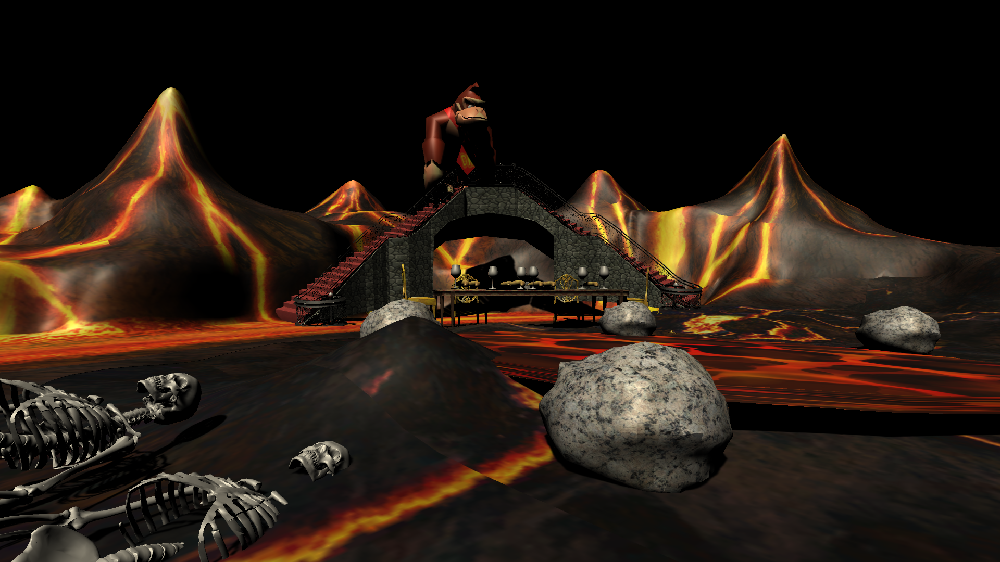

  

    
Gone Bananas

    

      <!-- <button aria-label="Minimize"></button>
      <button aria-label="Maximize"></button>
      <button aria-label="Close"></button> -->
    

  

  

    <menu role="tablist">
      <button aria-selected="true" aria-controls="Video">Work</button>
      <button aria-selected="false" aria-controls="Summary">Summary</button>
      <button aria-selected="false" aria-controls="Details">Details</button>
    </menu>
    <article role="tabpanel" id="Video">
        
    </article>
    <article role="tabpanel" hidden id="Summary" style="color: black; font-size: 14px; font-variant: JIS04; font-family: arial;">

"Gone Bananas" is my very first Unity project, a game where the player walks around a circle of Hell ruled by Donkey Kong. It was made in 2017 for a "walking simulator" assignment and is the inspiration for my later work in plunderludics.
    </article>
    <article role="tabpanel" hidden id="Details"  style="color: black; font-size: 14px; font-variant: JIS04; font-family: arial;">

### Year
2017

### Development Time
1 couple days

### Medium
Unity Game

    </article>
  

