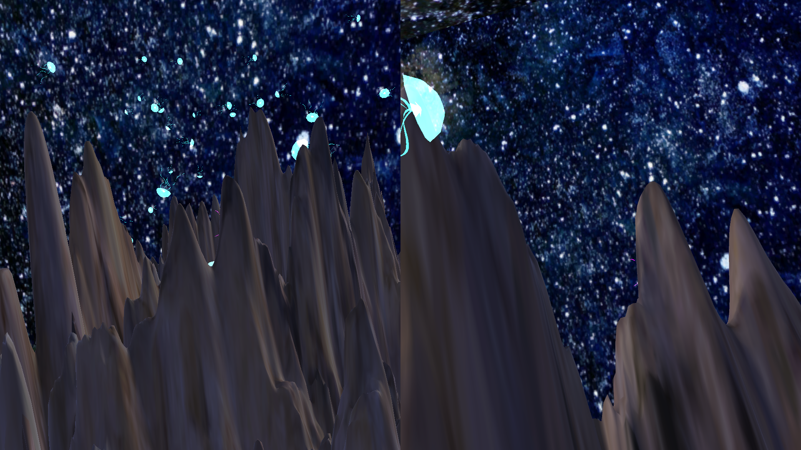

  

    
Gone Bananas

    

      <!-- <button aria-label="Minimize"></button>
      <button aria-label="Maximize"></button>
      <button aria-label="Close"></button> -->
    

  

  

    <menu role="tablist">
      <button aria-selected="true" aria-controls="Video">Work</button>
      <button aria-selected="false" aria-controls="Summary">Summary</button>
      <button aria-selected="false" aria-controls="Details">Details</button>
    </menu>
    <article role="tabpanel" id="Video">
        
    </article>
    <article role="tabpanel" hidden id="Summary" style="color: black; font-size: 14px; font-variant: JIS04; font-family: arial;">

"BLOOM" is a third person hide and seek style game aiming to simulate the movement of a jellyfish. Initially thought of as a splitscreen two-player experience, Bloom was inspired by the idea of finding comfort in someone or something.

This game was the final project of my experimental games class! I'd like to think it helped shape the games I end up making in the future.

    </article>
    <article role="tabpanel" hidden id="Details"  style="color: black; font-size: 14px; font-variant: JIS04; font-family: arial;">

### Year
2017

### Development Time
A few weeks

### Medium
Unity Game

    </article>
  

