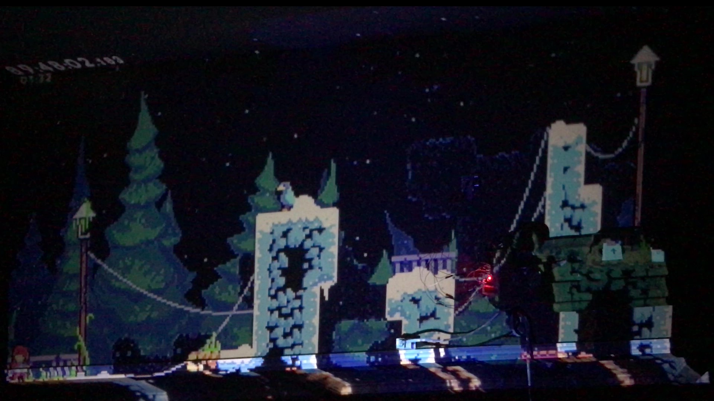
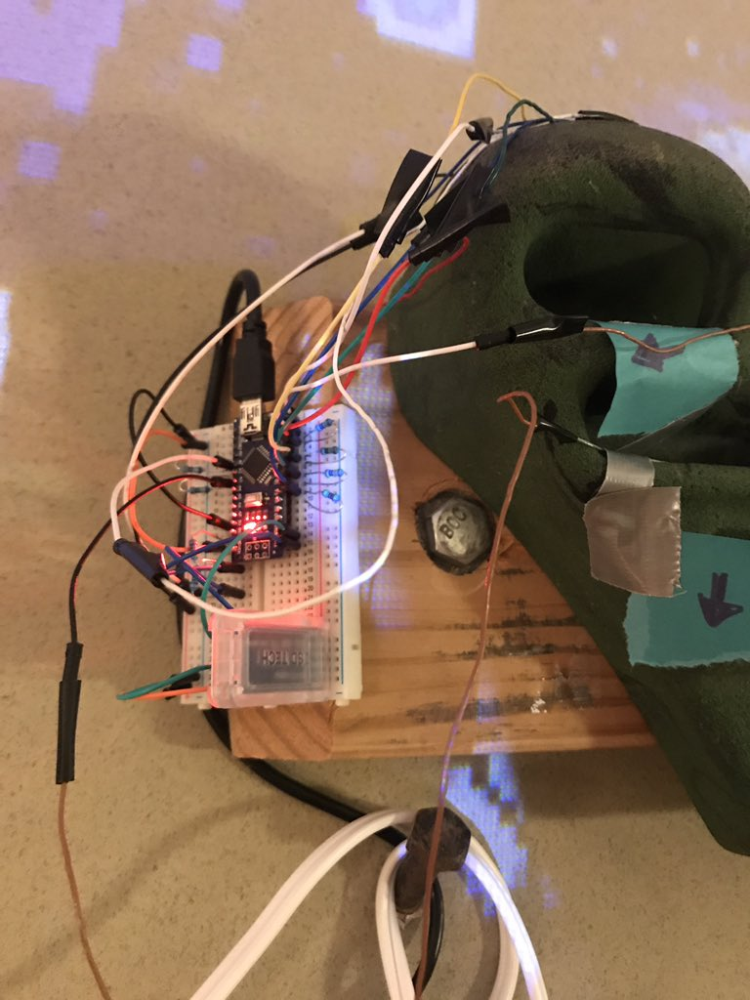
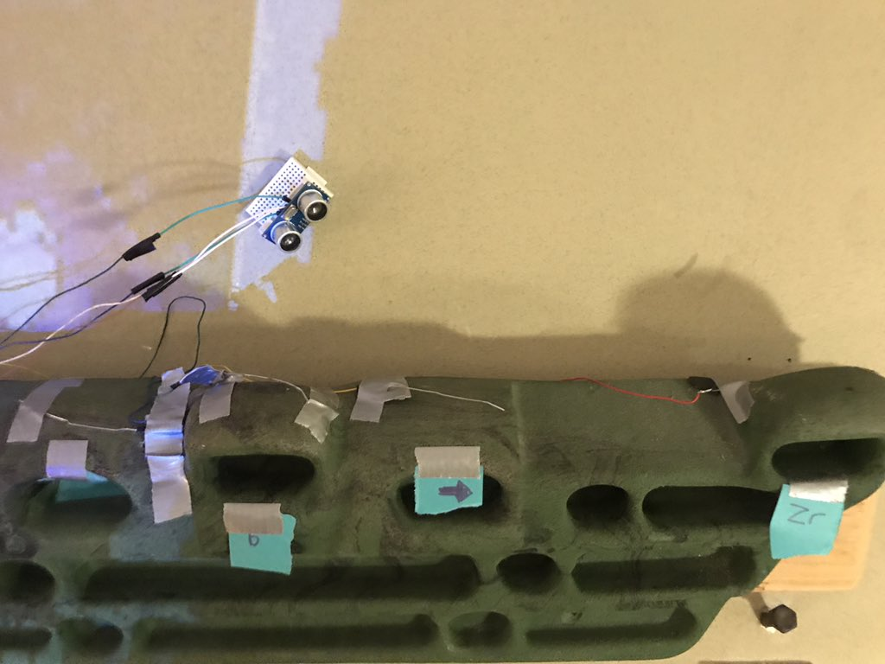
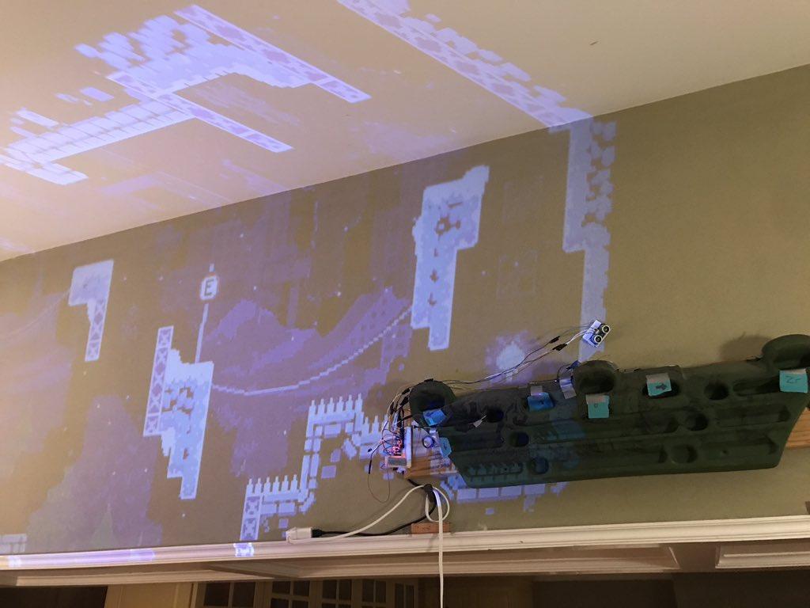
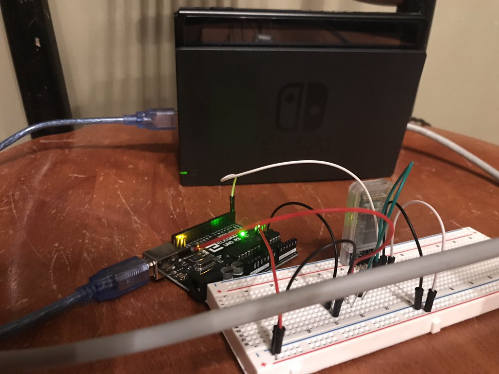
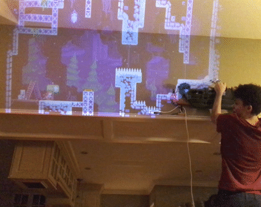

   

     
Hangboard Controller

     

       <!-- <button aria-label="Minimize"></button>
       <button aria-label="Maximize"></button>
       <button aria-label="Close"></button> -->
     

   

   

     <menu role="tablist">
       <button aria-selected="true" aria-controls="Video">Video</button>
       <button aria-selected="false" aria-controls="Summary">Summary</button>
       <button aria-selected="false" aria-controls="Details">Details</button>
       <button aria-selected="false" aria-controls="Awards">Awards</button>
     </menu>
     <article role="tabpanel" id="Video">
     
     
     </article>
     <article role="tabpanel" hidden id="Summary" style="color: black; font-size: 14px; font-variant: JIS04; font-family: arial;">
     
Hangboard Controller is a custom physical interface 
    emulating a Nintendo Switch controller that was developed to play EXOK's "Celeste". 
    The custom hangboard controller works through custom-flashed arduino firmware, an arduino sketch, 
    capacitive touch, ultrasonic data, and bluetooth. 

    
First, the controller is set up to have a number of 
    capacitive touch buttons, with paperclips used to detect touch. Additionally, an ultrasonic sensor is 
    set up above the hangboard to determine when I do a pull-up. The Arduino sketch on the Arduino Nano reads 
    in ultrasonic data, to see if I am doing a pull-up, as well as capacitive touch data, to see which buttons
        I am holding. It would then relay these inputs over to the Arduino Uno through bluetooth connection. 
        The Arduino Uno sketch would take this bluetooth input and write it to serial, where a custom-flashed
        firmware would emulate a wired switch controller, sending controller inputs through USB connected to my switch. 

    </article>
     <article role="tabpanel" hidden id="Details"  style="color: black; font-size: 14px; font-variant: JIS04; font-family: arial;">
 

 
 ### Year
 2019
 
 ### Development Time
 part-time, 1 week
 
 ### Medium
 Custom HID firmware, Arduino Sketch, Capacative Touch

 ### Responsibilities
 programming
 

     </article>
     <article role="tabpanel" hidden id="Awards"  style="color: black; font-size: 14px; font-variant: JIS04; font-family: arial;">
 
 ### Awards, Recognition, Showcases 
 <ul> 
     <li> 2020, Online. <a target="_blank" href="https://www.youtube.com/watch?v=XVCHNa_nkRk">Freeplay Independent Games Festival 2020</a> Featured Talk</li>

 </ul>
     </article>
     <article role="tabpanel" hidden id="DevLog"  style="color: black; font-size: 14px; font-variant: JIS04; font-family: arial;">
 
 ### Development Log
 <a target="_blank" href="https://drive.google.com/drive/folders/1dT2Lx3qaH6Y8LNbypsF2SCJsWUSLaeTr?usp=sharing">Playtest Screenshots, Assignment Reflection</a>  
     </article>
   

 

 
 
 
 

     <h1 class="title-bar" style="height:30px;">Gallery</h1>
 

 
   
   
   
   
   
   
   
 
 

 
