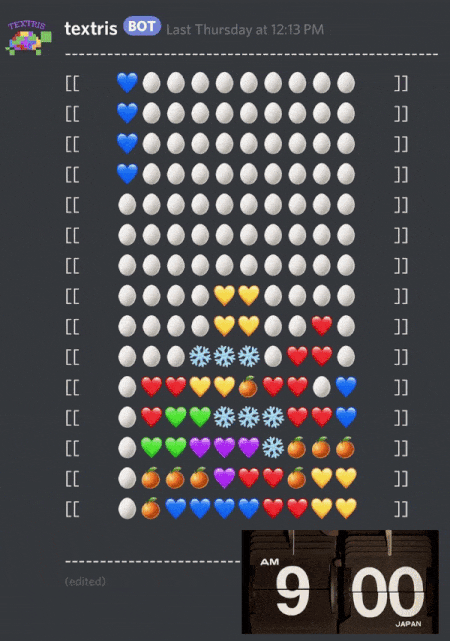

   

     
Textris

     

       <!-- <button aria-label="Minimize"></button>
       <button aria-label="Maximize"></button>
       <button aria-label="Close"></button> -->
     

   

   

     <menu role="tablist">
       <button aria-selected="true" aria-controls="Video">Video</button>
       <button aria-selected="false" aria-controls="Summary">Summary</button>
       <button aria-selected="false" aria-controls="Details">Details</button>
       <button aria-selected="false" aria-controls="Awards">Awards</button>
       <button aria-selected="false" aria-controls="DevLog">DevLog</button>
     </menu>
     <article role="tabpanel" id="Video">
     
     </article>
     <article role="tabpanel" hidden id="Summary" style="color: black; font-size: 14px; font-variant: JIS04; font-family: arial;">
     
TEXTRIS is the ultimate long distance, collaborative version of the popular arcade game. Play in a discord server with players around the world, working together to make sure the pieces never reach the top of the board. The game was initially created for an “asynchronous” game assignment. With a game always on, but very slow, players would have to check back on the game at their own convenience throughout the day. Since the game is collaborative, dozens of players tended to participate per server, even if they just liked moving the pieces back and forth.

    
The initial assignment, to take an existing game and make it asynchronous, came with some fun challenges. Technically, we had to figure out what medium and platform to have the game on such that we could all access it. Then, it was a matter of how the players would interact with it. We decided on a command-based discord bot. After deciding to iterate on the project, some other questions popped up: how often should the bot 'redraw' the board? We ended up developing a solution where the bot requires its own channel with only the board. Any time players want to interact with it, they would type in a command on that channel. The bot reads their command then deletes it, then performs the corresponding action. I also really enjoyed the 'hold' mechanic. Traditionally, tetris games allow players to hold a piece for later. With such a powerful action being available to anyone, we implemented a version of the mechanic that required multiple distinct users requesting the piece to be held, adding some interesting democracy tactics.

     
At its peak, the Textris bot belonged to over 200 discord servers. In checking the database on occasion, there always were dozens of games being played, most lasting several days and many lasting weeks or months. Due to a discord API update in 2022 Textris is no longer publicly available.

     
Textris was a project that got me used to DevOps, hosting bots, and databases. I learned how best to store data so that when the bot had to restart (once per day on the free Heroku plan) the game's state would not be interrupted.

    </article>
     <article role="tabpanel" hidden id="Details"  style="color: black; font-size: 14px; font-variant: JIS04; font-family: arial;">
 

 
 ### Year
 2020
 
 ### Development Time
 part-time, ~3 months
 
 ### Medium
 Node.js discord bot, MongoDB database, Heroku hosting

 ### Responsibilities
 programming, dev ops
 

     </article>
     <article role="tabpanel" hidden id="Awards"  style="color: black; font-size: 14px; font-variant: JIS04; font-family: arial;">
 
 ### Awards, Recognition, Showcases 
 <ul> 
     <li> 2020, Online. <a target="_blank" href="https://nordicgame.com/">Nordic Game Conference</a> Featured work</li>

 </ul>
     </article>
     <article role="tabpanel" hidden id="DevLog"  style="color: black; font-size: 14px; font-variant: JIS04; font-family: arial;">
 
 ### Development Log
 <a target="_blank" href="https://drive.google.com/drive/folders/1dT2Lx3qaH6Y8LNbypsF2SCJsWUSLaeTr?usp=sharing">Playtest Screenshots, Assignment Reflection</a>  
     </article>
   

 

 
 
 
 

     <h1 class="title-bar" style="height:30px;">Gallery</h1>
 

 
   
   
 
 

 
