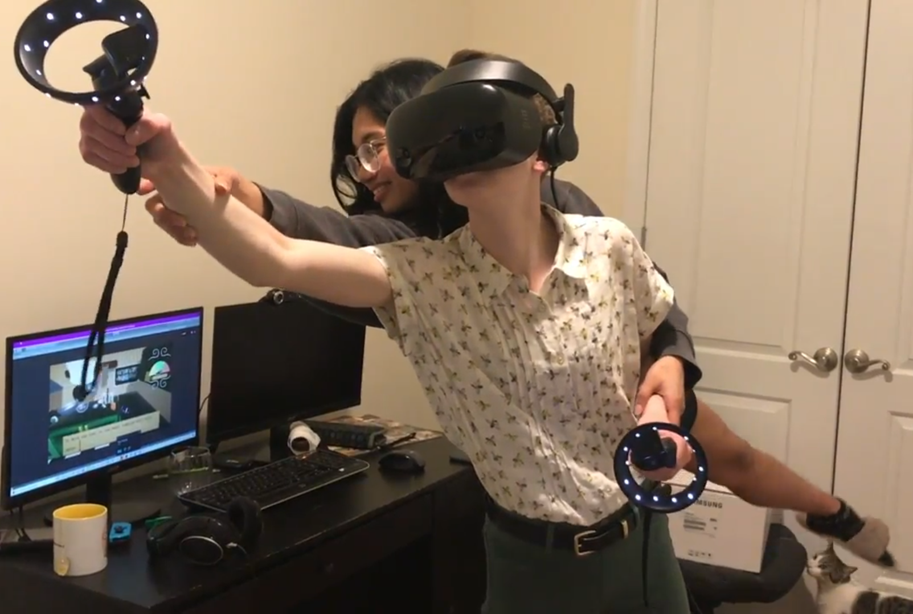
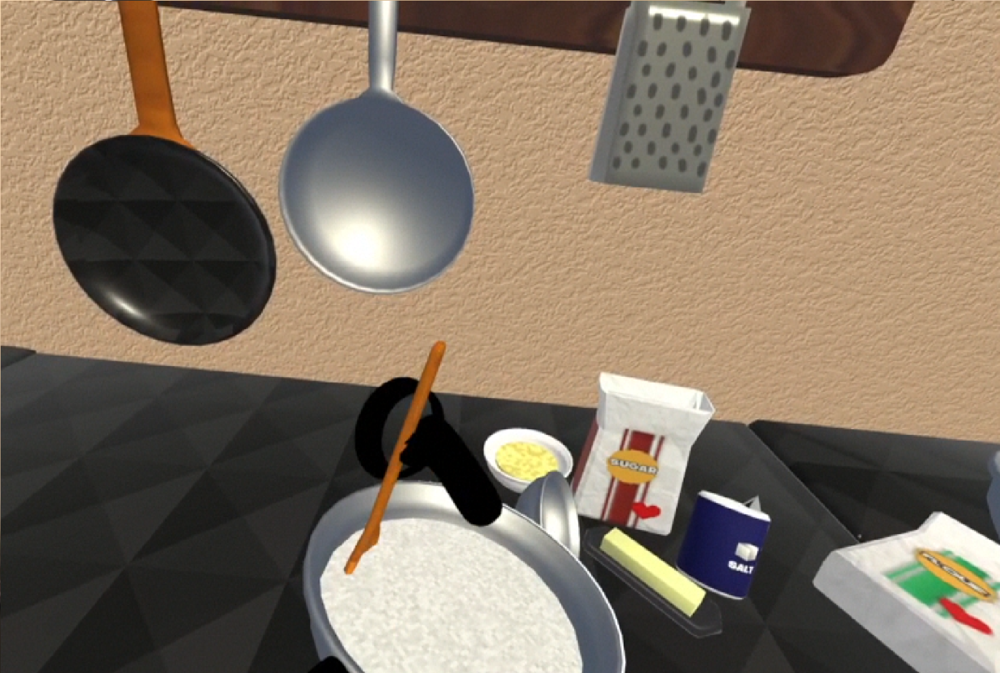

   

     
Chesstris 2000

     

       <!-- <button aria-label="Minimize"></button>
       <button aria-label="Maximize"></button>
       <button aria-label="Close"></button> -->
     

   

   

     <menu role="tablist">
       <button aria-selected="true" aria-controls="Video">Video</button>
       <button aria-selected="false" aria-controls="Summary">Summary</button>
       <button aria-selected="false" aria-controls="Details">Details</button>
       <button aria-selected="false" aria-controls="DevLog">DevLog</button>
     </menu>
     <article role="tabpanel" id="Video">
     
     </article>
     <article role="tabpanel" hidden id="Summary" style="color: black; font-size: 14px; font-variant: JIS04; font-family: arial;">
     
Just Like Grandma Used To Make... is a haunted cooking sim where you assemble a recipe step by step with ghostly assistance. In this multiplayer, asymmetric, alt ctrl VR game, players work together to assemble a recipe, with one player able to move objects, and the other players only able to move the VR player's arms. The game has two interfaces: one player, in the VR headset, can interact with a kitchen, while other players, outside the headset, can see a computer monitor with a third person view of the VR player.  In addition, the players outside of the headset can see an interface on their monitor that has a step by step recipe to assemble. The crux of Just Like Grandma Used To Make... is that the non-VR players are the ghost of granny, the only one who knows how to make the recipe. Since ghosts cant talk, the non VR players must guide the VR player to bake the required dish without talking. Instead, these players must physically move the chefs arms to guide them into the proper steps and gestures required by the recipe.

     
Just Like Grandma is one of the first 'larger' game projects I worked on. It came to be as I wondered what 'alternative controllers' could look like during the COVID shutdown, where people only had access to the hardware they had at home. It is also a continuation of some thoughts I had while taking a VR course in undergrad and doing an internship that dealt with VR. The primary motivation 

    </article>
     <article role="tabpanel" hidden id="Details"  style="color: black; font-size: 14px; font-variant: JIS04; font-family: arial;">
 

 
 ### Year
 2021
 
 ### Development Time
 part-time, ~2 months
 
 ### Medium
 Unity, C#, Blender

 ### Responsibilities
 programming, modeling, marketing
 

     </article>
     <article role="tabpanel" hidden id="Awards"  style="color: black; font-size: 14px; font-variant: JIS04; font-family: arial;">
 
 ### Awards, Recognition, Showcases 
 <ul> 
     <li> 2021, Online. <a target="_blank" href="https://pizzapranks.itch.io/indiepocalypse-21">Indiepocalypse Issue #21</a> Featured work</li>
     <li> 2022, Online. <a target="_blank" href="https://thunderperfectwitchcraft.org/arcane_cache/2022/12/19/chesstris-2000/">"Arcane Cache"</a> Review </li>
     <li> 2024, Online. <a target="_blank" href="https://virtualmoose.org/2024/12/12/review-chesstris-2000/">"Virtual Moose"</a> Review </li>

 </ul>
     </article>
     <article role="tabpanel" hidden id="DevLog"  style="color: black; font-size: 14px; font-variant: JIS04; font-family: arial;">
 
 ### Development Log
 
Despite my love of silly hardware, I am extremely critical of virtual reality as a games platform. My problem with it doesn’t necessarily lie with how clunky or hard to set up it is, my problem lies in its attempt to remove the user from its physical issues with its fantasy of “complete visual immersion”. Games certainly have power in embodying their players to take on a certain role, and rely on mechanics, narrative, and many other things in addition to “graphical output” to do so. Relying on graphical output alone, as I feel VR is guilty of, results in a tech-demo console arms race no one asked for. VR projects that do inspire me treat VR helmets as a blindfold. Not to immerse, but to remove, focusing on the negative space as much as immersion space. These games include Steel Crate Games’s Keep Talking and Nobody Explodes, and Double Fine’s I have No Idea What I’m Doing. These games acknowledge the existence of players outside the helmet, using visual immersion as a design constraint. With Just Like Grandma Used To Make.., I set out to take this concept one step further by designing the game to revolve around non-VR players physically guiding the VR player to do certain actions as though they were a person in a blindfold.

	
After thinking of several different blindfolded cooperative activities, I settled on cooking. I was especially captivated by the central “mechanic” in Pixar’s Ratatouille, where one player (a rat) sat on top of the other player’s (a chef’s) head, somehow manipulating their arms into cooking something.

A central design issue that persisted throughout the project was “is this an installation game? Or a game that anyone with a system can play?” Early on, I thought of taking the Ratatouille idea literally, with one player situated above the other, controlling the person in VR with marionette-esque strings and handles. Starting development in my small apartment during a pandemic, however, I sought to design the game to be simpler to set up and easily replicable for anyone. I still wanted to encourage the physical silliness common with spectated installation games, so I made a paper chef hat and got an apron for the VR player.

	
Another design question that lingered during development related to the type of tasks the VR person was set out to do. If the tasks were too complicated, the chef might get frustrated from being “too controlled”. On the other hand, having tasks too obvious would eliminate the need for a non-VR player. The middle ground was creating a ‘mini-game’ for each task, where the chef had to perform an obvious action with the non-VR player providing them necessary feedback. For example, the non-VR player would have to guide the chef to choose a specific ingredient. Then, as the chef pours the ingredient into a bowl, a meter would spawn on the external monitor that the non-VR player sees, telling them when to stop. This would mean the non-VR player has to jerk the chef’s arms to stop pouring at precisely the right time. 

	
Some potential shortcomings of this project to be fixed with further iteration include randomizing recipes, steps, and other variables. Despite being a “fun to watch” game, if you watch and then play it, you’ve then ruined part of the “surprise” of being the VR player.
Just Like Grandma Used To Make.. is a haunted cooking simulator, played asymmetrically with VR. I developed the game entirely by myself over the course of about a month. The game requires a PC-ready VR headset compatible with SteamVR, an external monitor, plenty of space, and as many fun cooking outfit accessories as you would like.

     </article>
   

 

 
 
 
 

     <h1 class="title-bar" style="height:30px;">Gallery</h1>
 

 
   
   
   
 
 

 
