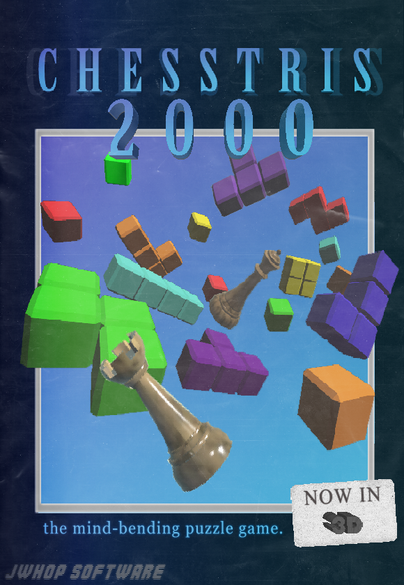
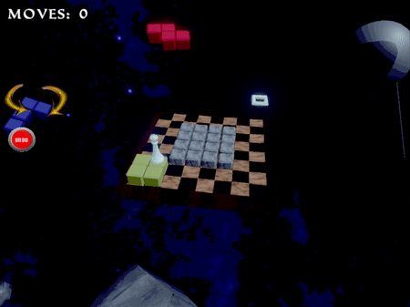
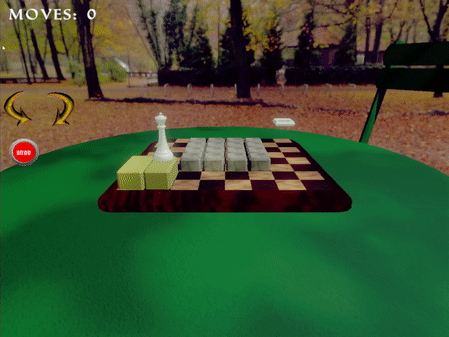

   

     
Chesstris 2000

     

       <!-- <button aria-label="Minimize"></button>
       <button aria-label="Maximize"></button>
       <button aria-label="Close"></button> -->
     

   

   

     <menu role="tablist">
       <button aria-selected="true" aria-controls="Video">Video</button>
       <button aria-selected="false" aria-controls="Summary">Summary</button>
       <button aria-selected="false" aria-controls="Details">Details</button>
       <button aria-selected="false" aria-controls="Awards">Awards</button>
       <button aria-selected="false" aria-controls="DevLog">DevLog</button>
     </menu>
     <article role="tabpanel" id="Video">
     
     </article>
     <article role="tabpanel" hidden id="Summary" style="color: black; font-size: 14px; font-variant: JIS04; font-family: arial;">
     
"Chesstris 2000" is part block pushing game and part love letter to the forgotten tetris spinoffs of the 90s and 2000s. Throughout the game, players must navigate a chess piece attached to a tetris block to an exit square on the board. Eventually, players learn to master not only different chess pieces -- pawns, rooks, knights-- but also different tetromino shapes, line clears, and more!

    
A major focus of developing Chesstris 2000 involved not only making its puzzles fun, but also making its ~~vibes~~  coherent. An homage to titles like Tetris for Philips CD-i, Tetrisphere, Myst, educational software, the game features three different whimsical, soothing environments and a vaporwave soundtrack by <a target="_blank" href="https://steviasphere.bandcamp.com/">Stevia Sphere</a>.

    
I made Chesstris 2000 over the course of a couple of months. There are 30+ levels and takes the average player about 2 hours to play through. I'd say it's my most complete game! It's also the game that taught me game development -- my first "big" thing. I found the level design / 'content' portion very fun! There was definitely a balance between trying new concepts and keeping the game breezy. Looking back on it there are a ton of performance tweaks I could make but am proud of doing something this complete with its own visual flourish all by myself.

    
check out the game <a target="_blank" href="https://jwhop.itch.io/chesstris-puzzle">here!</a>

    </article>
     <article role="tabpanel" hidden id="Details"  style="color: black; font-size: 14px; font-variant: JIS04; font-family: arial;">
 

 
 ### Year
 2021
 
 ### Development Time
 part-time, ~3 months
 
 ### Medium
 Unity, C#, Blender

 ### Responsibilities
 programming, modeling, marketing
 

     </article>
     <article role="tabpanel" hidden id="Awards"  style="color: black; font-size: 14px; font-variant: JIS04; font-family: arial;">
 
 ### Awards, Recognition, Showcases 
 <ul> 
     <li> 2021, Online. <a target="_blank" href="https://pizzapranks.itch.io/indiepocalypse-21">Indiepocalypse Issue #21</a> Featured work</li>
     <li> 2022, Online. <a target="_blank" href="https://thunderperfectwitchcraft.org/arcane_cache/2022/12/19/chesstris-2000/">"Arcane Cache"</a> Review </li>
     <li> 2024, Online. <a target="_blank" href="https://virtualmoose.org/2024/12/12/review-chesstris-2000/">"Virtual Moose"</a> Review </li>

 </ul>
     </article>
     <article role="tabpanel" hidden id="DevLog"  style="color: black; font-size: 14px; font-variant: JIS04; font-family: arial;">
 
 ### Development Log
 <a target="_blank" href="https://jwhop.itch.io/chesstris-puzzle/devlog/266755/chesstris-2000-postmortem">Post Mortem</a>  
     </article>
   

 

 
 
 
 

     <h1 class="title-bar" style="height:30px;">Gallery</h1>
 

 
   
   
   
   
   
   
 
 

 

<!-- <iframe class="max-w-full" frameborder="100" src="https://itch.io/embed-upload/4300846?color=887f71" allowfullscreen="" width="1300" height="808"><a href="https://jwhop.itch.io/chesstris-puzzle">Play Chesstris 2000 on itch.io</a></iframe> -->