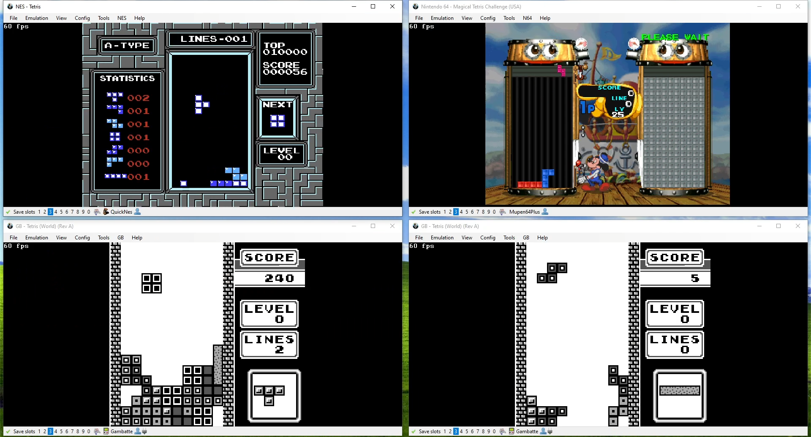
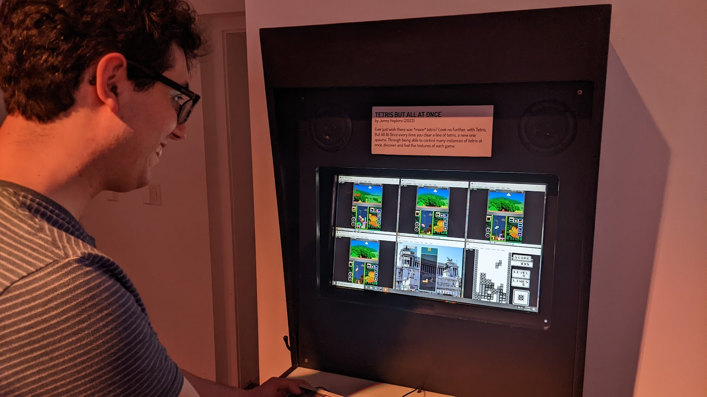
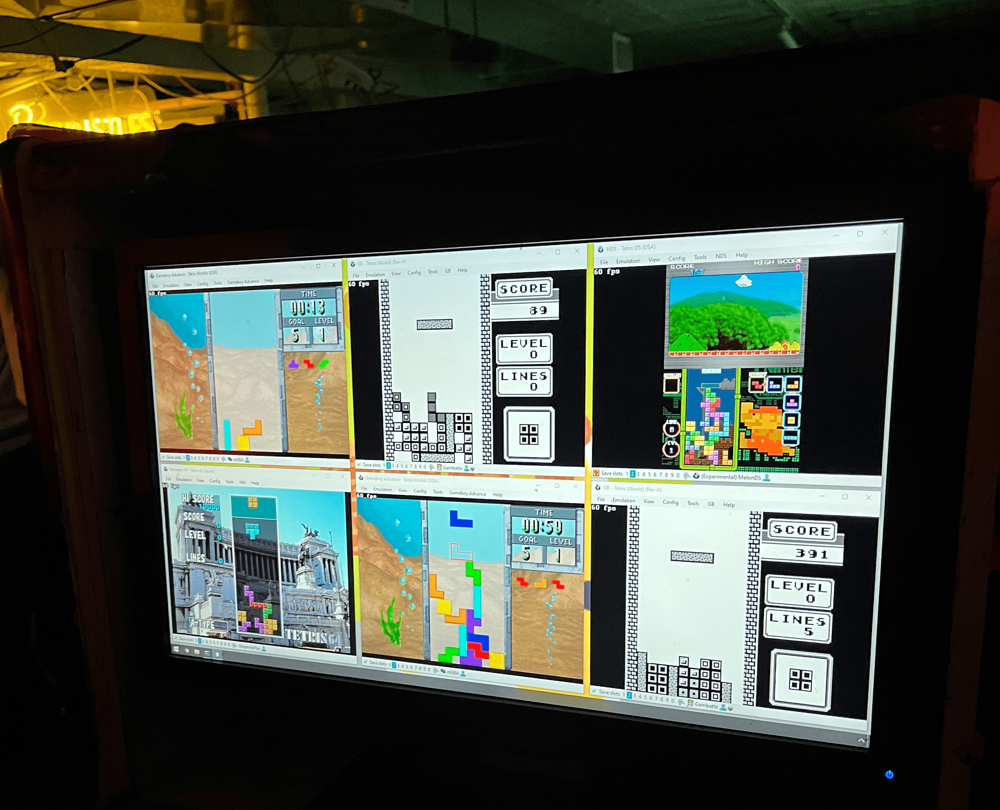

   

     
tetris, but all at once

     

       <!-- <button aria-label="Minimize"></button>
       <button aria-label="Maximize"></button>
       <button aria-label="Close"></button> -->
     

   

   

     <menu role="tablist">
       <button aria-selected="true" aria-controls="Video">Video</button>
       <button aria-selected="false" aria-controls="Summary">Summary</button>
       <button aria-selected="false" aria-controls="Details">Details</button>
       <button aria-selected="false" aria-controls="Awards">Awards</button>
       <!--<button aria-selected="false" aria-controls="DevLog">DevLog</button> -->
     </menu>
     <article role="tabpanel" id="Video">
     
     </article>
     <article role="tabpanel" hidden id="Summary" style="color: black; font-size: 14px; font-variant: JIS04; font-family: arial;">
     
Ever just wish there was more tetris? Look no further, with "tetris, but all at once". Every time you clear a line of tetris, a new one spawns. Through being able to control many instances of tetris at once, discover and feel the textures of each game.

    
TBAAO is written in a Lua script that attaches to the bizhawk emulator. I look at specific memory addresses in each game [when lines are cleared] and use a winapi lua call to resize + tile the windows as a new one spawns in. Major credit on how to make something like this goes to <a target="_blank" href="https://www.alistairaitcheson.com/games/magicbox.html">Alistair Aitcheson's Magic Box!</a>

    
check out the game <a target="_blank" href="https://jwhop.itch.io/tetris-but-all-at-once">here!</a> password is 'gaw'

    </article>
     <article role="tabpanel" hidden id="Details"  style="color: black; font-size: 14px; font-variant: JIS04; font-family: arial;">
 

 
 ### Year
 2023
 
 ### Development Time
 part-time, 1 week
 
 ### Medium
 Lua Script, Bizhawk Emulator, tetris ROMS

 ### Responsibilities
 programming
 

     </article>
     <article role="tabpanel" hidden id="Awards"  style="color: black; font-size: 14px; font-variant: JIS04; font-family: arial;">
 
 ### Awards, Recognition, Showcases 
 <ul> 
    <li> 2022, Babycastles, Brooklyn, New York. <a target="_blank" href="https://www.instagram.com/p/Clh1jzxNE2X/?hl=en">"babycastles: maybe the last event ever maybe"</a> Featured work</li>
     <li> 2023, boshi's place, Brooklyn, New York. <a target="_blank" href="https://plunderludics.github.io/devlogs/2023-02-25%20spring%20salad.html">"Spring Salad: A Plunderludic Gathering"</a> Featured work</li>
     <li> 2024, LIKELIKE, Pittsburgh, Pennsylvania. <a target="_blank" href="https://likelike.org/2024/05/29/plundergames/">"PLUNDERGAMES"</a> Featured work</li>
     <li> 2025, Online. <a target="_blank" href="https://eggplant.show/145-addressing-memory-with-plunderludics">"The Secret Lives of Games"</a> Podcast Episode</li>
 </ul>
     </article>
     <article role="tabpanel" hidden id="DevLog"  style="color: black; font-size: 14px; font-variant: JIS04; font-family: arial;">
 
 ### Development Log
 TBA. Add in progress pics here  
     </article>
   

 

 
 
 
 

     <h1 class="title-bar" style="height:30px;">Gallery</h1>
 

 
   
   
   
   
   
   
   
   
 
 

 
