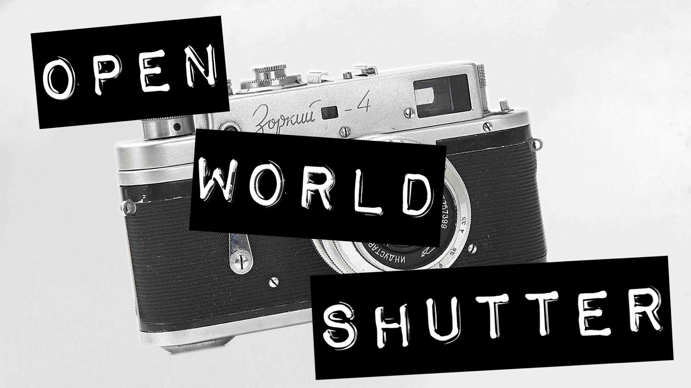
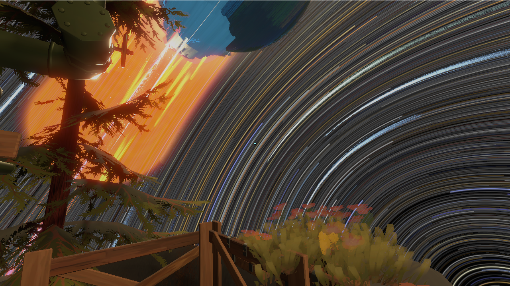
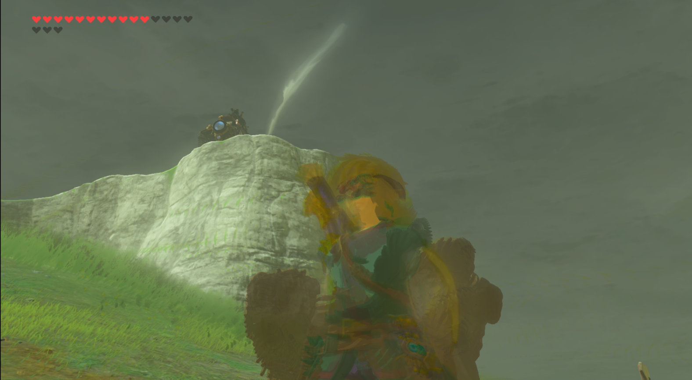
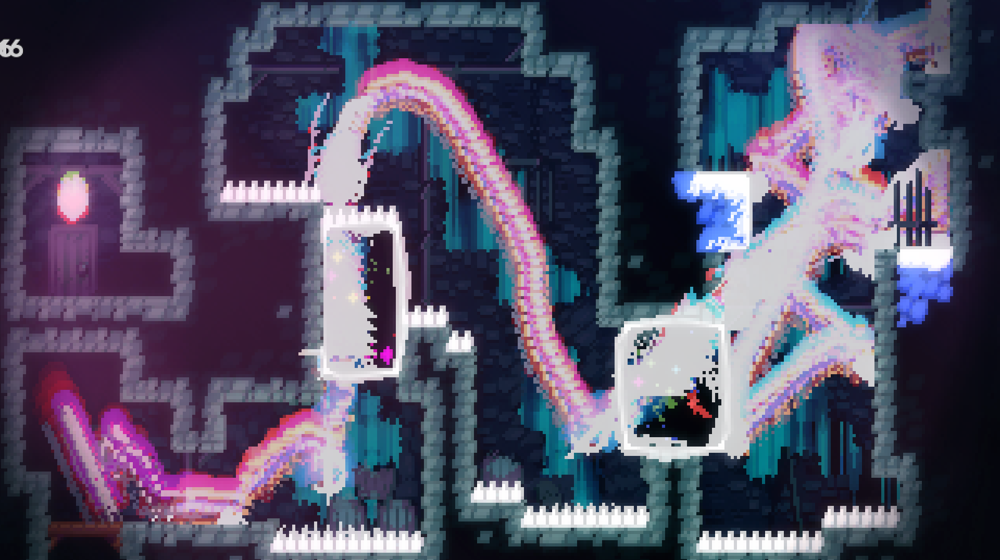

   

     
Open World Shutter

     

       <!-- <button aria-label="Minimize"></button>
       <button aria-label="Maximize"></button>
       <button aria-label="Close"></button> -->
     

   

   

     <menu role="tablist">
       <button aria-selected="true" aria-controls="Video">Video</button>
       <button aria-selected="false" aria-controls="Summary">Summary</button>
       <button aria-selected="false" aria-controls="Details">Details</button>
       <button aria-selected="false" aria-controls="Awards">Awards</button>
       <!--<button aria-selected="false" aria-controls="DevLog">DevLog</button> -->
     </menu>
     <article role="tabpanel" id="Video">
     
     
     </article>
     <article role="tabpanel" hidden id="Summary" style="color: black; font-size: 14px; font-variant: JIS04; font-family: arial;">
     
"Open World Shutter" is a desktop screenshotting tool to make your game captures more fun! Take screenshots with varying exposure lengths. How will you set up your shots?

    
OWS is written in python using mss, cv2, and pyQT. Images are captured of an application window and then are saved, keeping track of average pixels, brightest pixels, and darkest pixels. Video timelapses are also supported!

    
check out the <a target="_blank" href="https://github.com/jwhop/Open-World-Shutter">Open World Shutter Source Code on Github</a>

    
download the <a target="_blank" href="https://jwhop.itch.io/open-world-shutter">Open World Shutter Executable on Itch.io</a>

    </article>
     <article role="tabpanel" hidden id="Details"  style="color: black; font-size: 14px; font-variant: JIS04; font-family: arial;">
 

 
 ### Year
 2022
 
 ### Development Time
 part-time, 1 month
 
 ### Medium
 Digital Tool using python and PyQT

 ### Responsibilities
 programming, assets
 

     </article>
     <article role="tabpanel" hidden id="Awards"  style="color: black; font-size: 14px; font-variant: JIS04; font-family: arial;">
 
 ### Awards, Recognition, Showcases 
 <ul> 
     <li> 2022, Ideal Glass Studio, New York. <a target="_blank" href="https://web.archive.org/web/20230714084438/https://photomode-ubisoft.com/en/">"Ubisoft Presents Photomode: Out There in Games"</a> Featured work</li>
     <li> 2023, Silent Green, Berlin. <a target="_blank" href="https://2023.amaze-berlin.de/nominees/">"A MAZE. BERLIN international Games and Playful Media Festival"</a> Honorable Mention</li>
     <li> 2025, New York, New York. <a target="_blank" href="https://www.are.na/cristobal-sciutto/screenshot-conf">"Screenshot Conf"</a> Featured Talk</li>
 </ul>
     </article>
     <article role="tabpanel" hidden id="DevLog"  style="color: black; font-size: 14px; font-variant: JIS04; font-family: arial;">
 
 ### Development Log
 TBA. Add in progress pics here  
     </article>
   

 

 
 
 
 

     <h1 class="title-bar" style="height:30px;">Gallery</h1>
 

 
   
   
   
   
   
   
 
 

 
