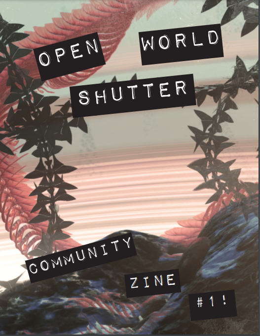
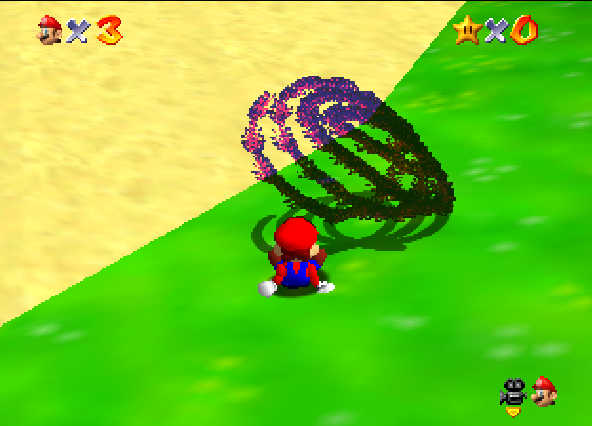
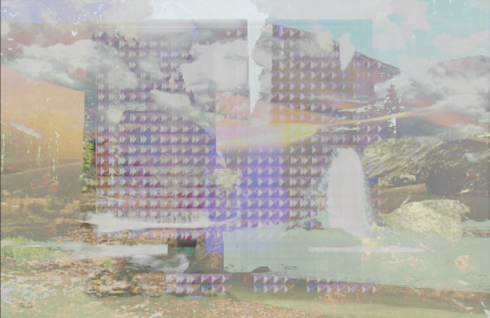
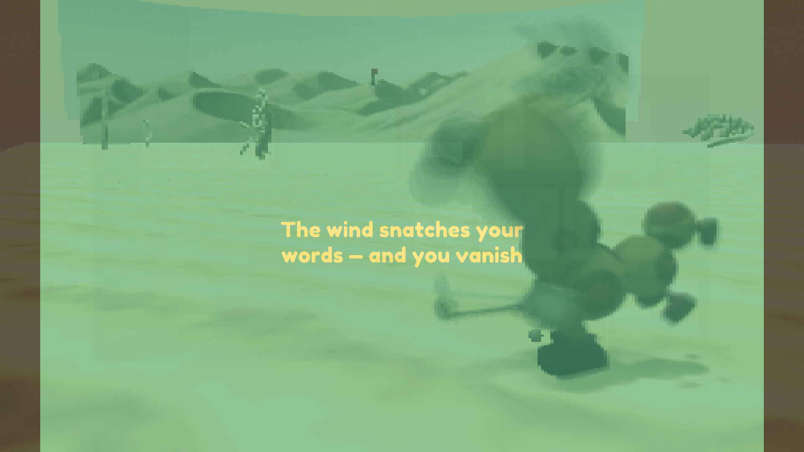

  

    
OWS Community Jam

    

      <!-- <button aria-label="Minimize"></button>
      <button aria-label="Maximize"></button>
      <button aria-label="Close"></button> -->
    

  

  

    <menu role="tablist">
      <button aria-selected="true" aria-controls="Summary">Summary</button>
      <button aria-selected="false" aria-controls="Details">Details</button>
      <button aria-selected="false" aria-controls="Awards">Awards</button>
      <button aria-selected="false" aria-controls="DevLog">DevLog</button>
    </menu>
    <article role="tabpanel" id="Summary" style="color: black; font-size: 14px; font-variant: JIS04; font-family: arial;">
    
--To celebrate <a target="_blank" href="https://jwhop.itch.io/open-world-shutter">Open World Shutter</a> being included in A MAZE 2023, I ran a community photo jam using the tool, and compiled submissions into a zine.--  Over the course of april, I tasked artists and photographers to capture digital long exposures with Open World Shutter. The goal was to embrace virtual photography and to make art that fits the following theme&nbsp;

<h2 class="text-center">SYNTHESIS</h2>

 

here is the result!&nbsp;  featuring work from:&nbsp; BigNastyTruck, Ben, Heidi, Tristan, Fortho, Sci + Nick, Forgdeer, D3mark0, Hypern0thingness, Mut, Kookooshka + Cryctok baл, Jwest, Spiffsnaps, Tyler Rhodes, Tipsheda, Kosha, Drew, Patricia, Jackk, Johnlee Cooper, Kent Sheely, Mяybay, and Marquise!  extra special thanks for JWEST for the cover&nbsp; and itch thumbnail photo,&nbsp;and to BigNastyTruck, SpiffSnaps, Patricia, and Mut for the page backgrounds!  also shout out to the A MAZE. Berlin team for helping to show the zine at this years festival &lt;3

    </article>
    <article role="tabpanel" hidden id="Details"  style="color: black; font-size: 14px; font-variant: JIS04; font-family: arial;">

### Year
2023

### Development Time
one month jam

### Medium
Digital Image using OWS

### Responsibilities
Capturing Images, Creating Zine

    </article>
    <article role="tabpanel" hidden id="Awards"  style="color: black; font-size: 14px; font-variant: JIS04; font-family: arial;">

### Awards, Recognition, Showcases 
<ul> 
    <li> 2023, Berlin. <a href="https://2023.amaze-berlin.de/nominees/"><i>A MAZE. Berlin Honorable Mention</i></a></li>
</ul>
    </article>
    <article role="tabpanel" hidden id="DevLog"  style="color: black; font-size: 14px; font-variant: JIS04; font-family: arial;">

### Development Log
TBA. Add in progress pics here  
    </article>
  

    <h1 class="title-bar" style="height:30px;">Gallery</h1>


  
  
  
  


