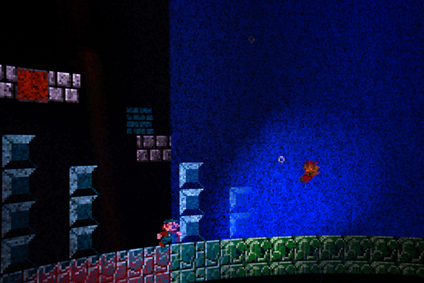

 

   

     
 Mario Tag 

     

       <!-- <button aria-label="Minimize"></button>
       <button aria-label="Maximize"></button>
       <button aria-label="Close"></button> -->
     

   

   

     <menu role="tablist">
       <button aria-selected="true" aria-controls="Video">Video</button>
       <button aria-selected="false" aria-controls="Summary">Summary</button>
       <button aria-selected="false" aria-controls="Details">Details</button>
       <button aria-selected="false" aria-controls="Awards">Awards</button>
       <button aria-selected="false" aria-controls="DevLog">DevLog</button>
     </menu>
     <article role="tabpanel" id="Video">
     
     </article>
     <article role="tabpanel" hidden id="Summary" style="color: black; font-size: 14px; font-variant: JIS04; font-family: arial;">
     
“Mario Tag” is a 360 degree 2-player videogame collage take on Mario, using practices of “plunderludics” to manipulate the original ROM and two simultaneous NES emulator instances. Each Mario runs around a looping screen to a different level, racing to hold onto a flag longer than their opponent. Created with Plunderludics Working Group.

     </article>
     <article role="tabpanel" hidden id="Details"  style="color: black; font-size: 14px; font-variant: JIS04; font-family: arial;">
 

 
 ### Year
 2024
 
 ### Development Time
 part time, 3 months
 
 ### Medium
 Digital Game for custom display

 ### Responsibilities
 Shared concept work, shader programming, bug fixing
 

     </article>
     <article role="tabpanel" hidden id="Awards"  style="color: black; font-size: 14px; font-variant: JIS04; font-family: arial;">
 
 ### Awards, Recognition, Showcases 
 <ul> 
     <li> 2024, Boshi's Place, Brooklyn, New York. "Boshi's 1st Birthday" Featured work</li>
     <li> 2024, Hong Kong Baptist University, Kowloon Tong, Hong Kong. "Looped Play" Commissioned work</li>
 </ul>
     </article>
     <article role="tabpanel" hidden id="DevLog"  style="color: black; font-size: 14px; font-variant: JIS04; font-family: arial;">
 
 ### Development Log
 TBA. Add in progress pics here  
     </article>
   

 

 
 
 
 

     <h1 class="title-bar" style="height:30px;">Gallery</h1>
 

 
   
   
   
 
 

 
