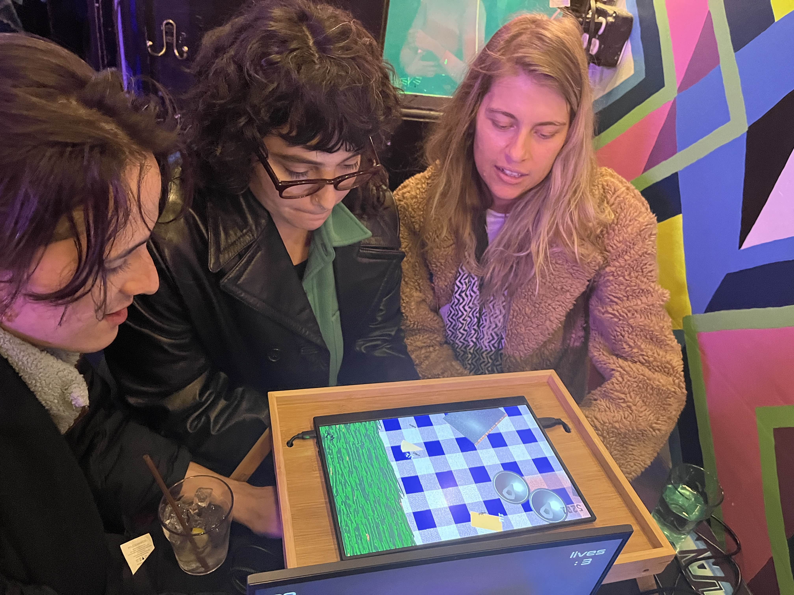
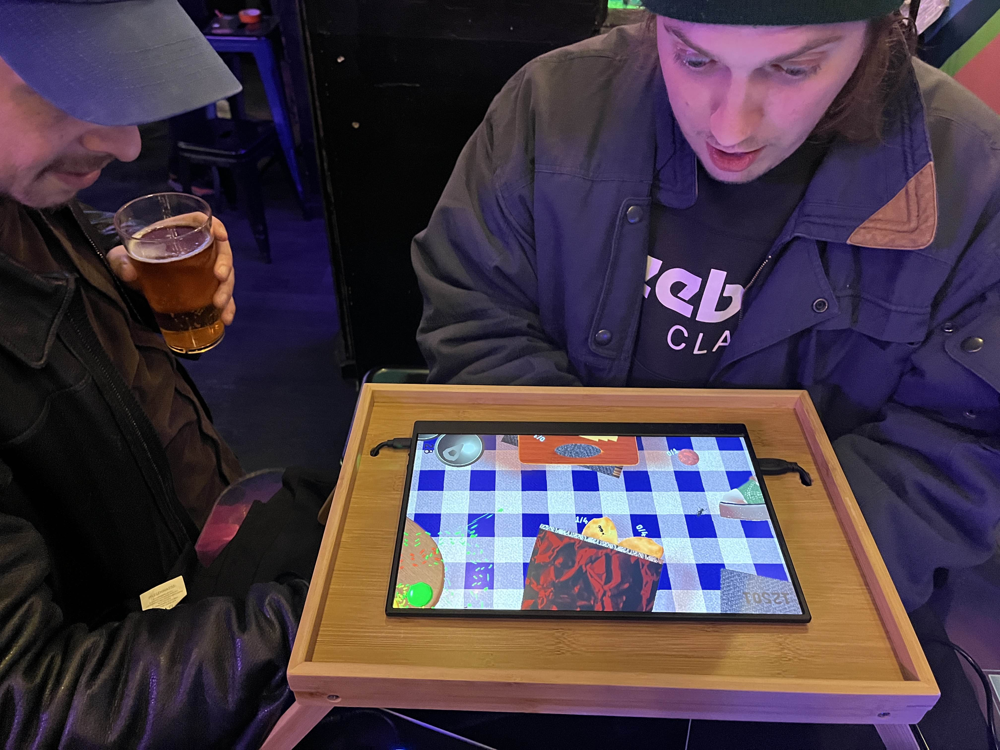
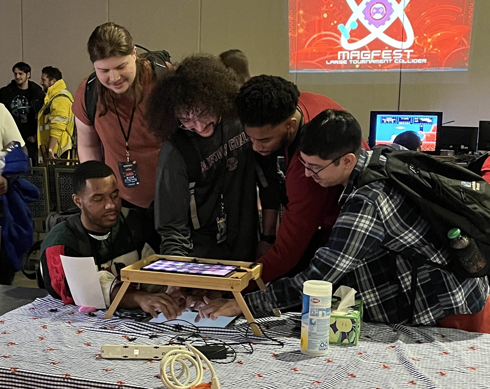

  

    
We Are All Ants

    

      <!-- <button aria-label="Minimize"></button>
      <button aria-label="Maximize"></button>
      <button aria-label="Close"></button> -->
    

  

  

    <menu role="tablist">
      <button aria-selected="true" aria-controls="Video">Video</button>
      <button aria-selected="false" aria-controls="Summary">Summary</button>
      <button aria-selected="false" aria-controls="Details">Details</button>
      <button aria-selected="false" aria-controls="Awards">Awards</button>
      <button aria-selected="false" aria-controls="DevLog">DevLog</button>
    </menu>
    <article role="tabpanel" id="Video">
    
    </article>
    <article role="tabpanel" hidden id="Summary" style="color: black; font-size: 14px; font-variant: JIS04; font-family: arial;">
    
We are all ants is a game for 2 to 10 fingers, and however many players that involves. Made using touch input and a custom physical installation, players look down on a screen where each of their fingers turns into a procedurally animated ant. Work together to move things around!

    </article>
    <article role="tabpanel" hidden id="Details"  style="color: black; font-size: 14px; font-variant: JIS04; font-family: arial;">

### Year
2023

### Development Time
started as school assignment, then a few weeks of part time work

### Medium
Touch Screen, External Display

### Responsibilities
Misc. 3D Art (ants, food props), programming, installation

    </article>
    <article role="tabpanel" hidden id="Awards"  style="color: black; font-size: 14px; font-variant: JIS04; font-family: arial;">

### Awards, Recognition, Showcases 
<ul> 
    <li> 2024, Brooklyn, New York. "Wonderville Pop Up Arcade" Featured Work</li>
    <li> 2024, District of Columbia. "MAGfest Indie Arcade" Featured Work</li>
</ul>
    </article>
    <article role="tabpanel" hidden id="DevLog"  style="color: black; font-size: 14px; font-variant: JIS04; font-family: arial;">

### Development Log
TBA. Add in progress pics here  
    </article>
  

    <h1 class="title-bar" style="height:30px;">Gallery</h1>


  
  
  
  
  


