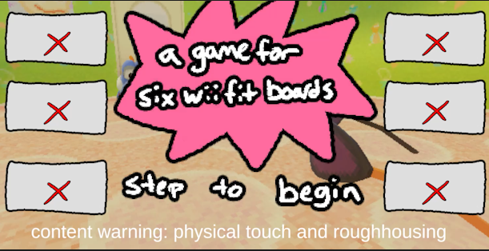
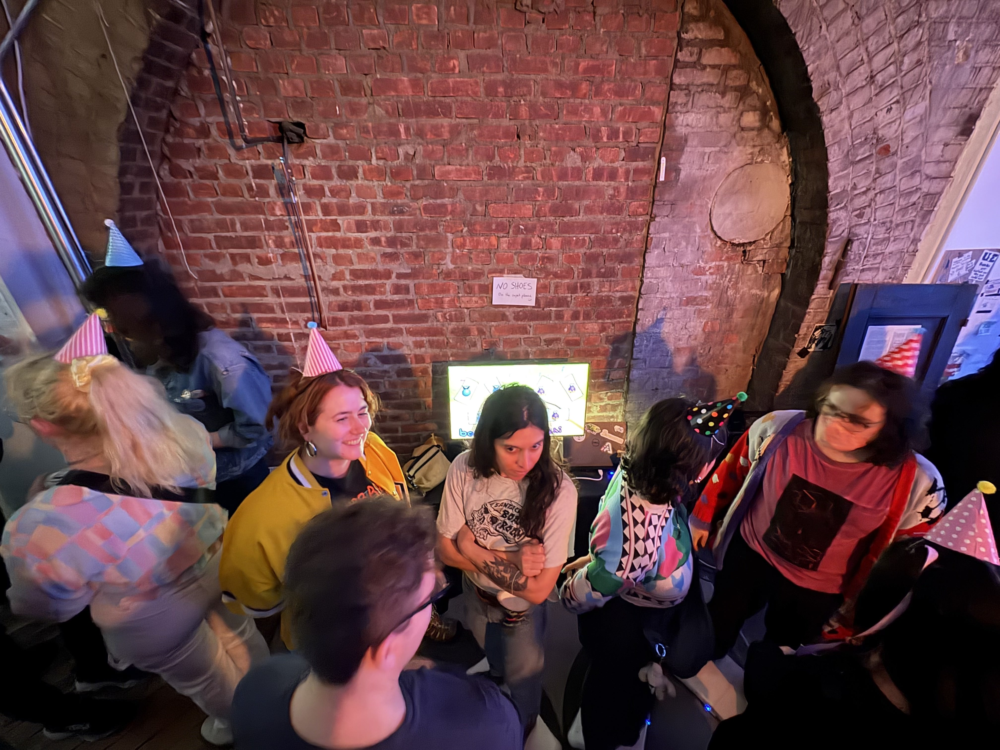

  

    
A Game For Six Wii Fit Boards

    

      <!-- <button aria-label="Minimize"></button>
      <button aria-label="Maximize"></button>
      <button aria-label="Close"></button> -->
    

  

  

    <menu role="tablist">
      <button aria-selected="true" aria-controls="Video">Video</button>
      <button aria-selected="false" aria-controls="Summary">Summary</button>
      <button aria-selected="false" aria-controls="Details">Details</button>
      <button aria-selected="false" aria-controls="Awards">Awards</button>
    </menu>
    <article role="tabpanel" id="Video">
    
    </article>
    <article role="tabpanel" hidden id="Summary" style="color: black; font-size: 14px; font-variant: JIS04; font-family: arial;">
    
A Game For Six Wii Fit Boards is a silly party game made for boshi's second birthday, a games event in brooklyn, ny. The game features a series of minigames that require players to leave their board, run onto their board, and battle each other to stay on top of their board.

    </article>
    <article role="tabpanel" hidden id="Details"  style="color: black; font-size: 14px; font-variant: JIS04; font-family: arial;">

### Year
2025

### Development Time
one week

### Medium
Unity Game, Six Wii Fit Boards

    </article>
    <article role="tabpanel" hidden id="Awards"  style="color: black; font-size: 14px; font-variant: JIS04; font-family: arial;">

### Awards, Recognition, Showcases 
<ul> 
    <li> 2025, Brooklyn, New York. "boshi's second birthday" Featured Work</li>
</ul>
    </article>
    <article role="tabpanel" hidden id="DevLog"  style="color: black; font-size: 14px; font-variant: JIS04; font-family: arial;">

### Development Log
TBA. Add in progress pics here  
    </article>
  

    <h1 class="title-bar" style="height:30px;">
      
Gallery

    </h1>


  
  


