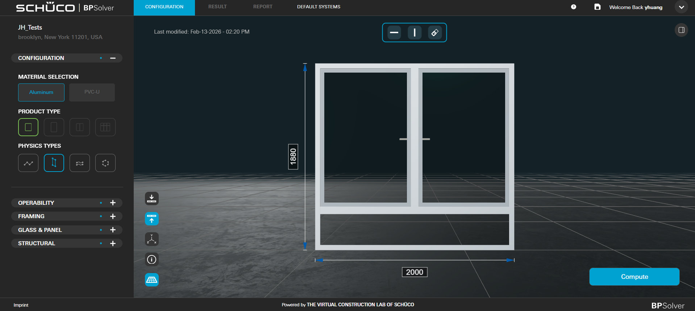
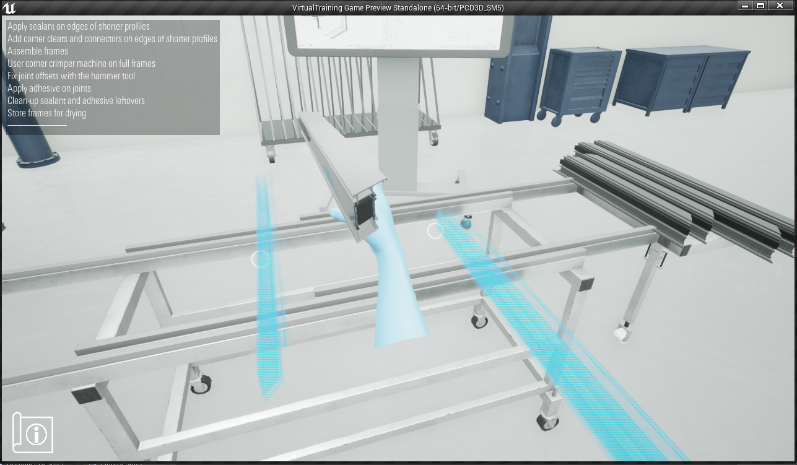
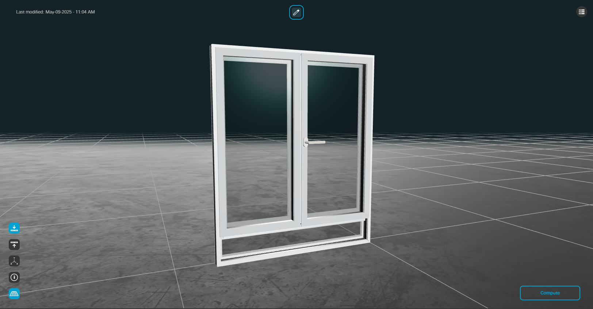
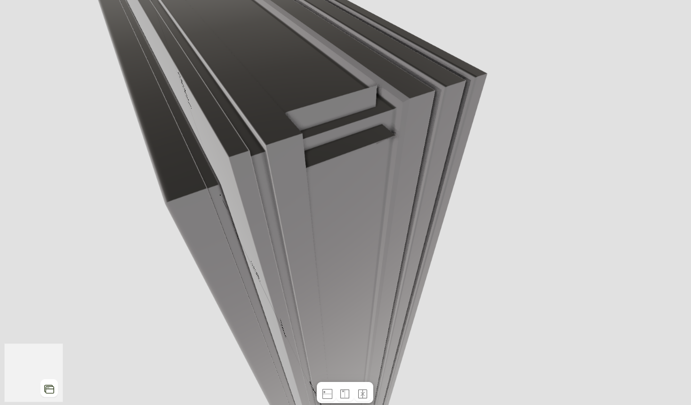
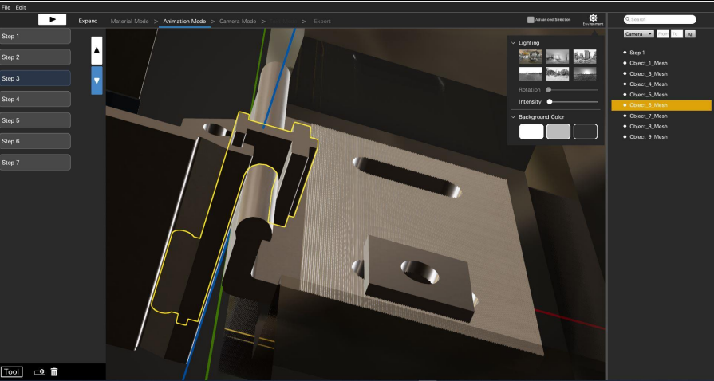
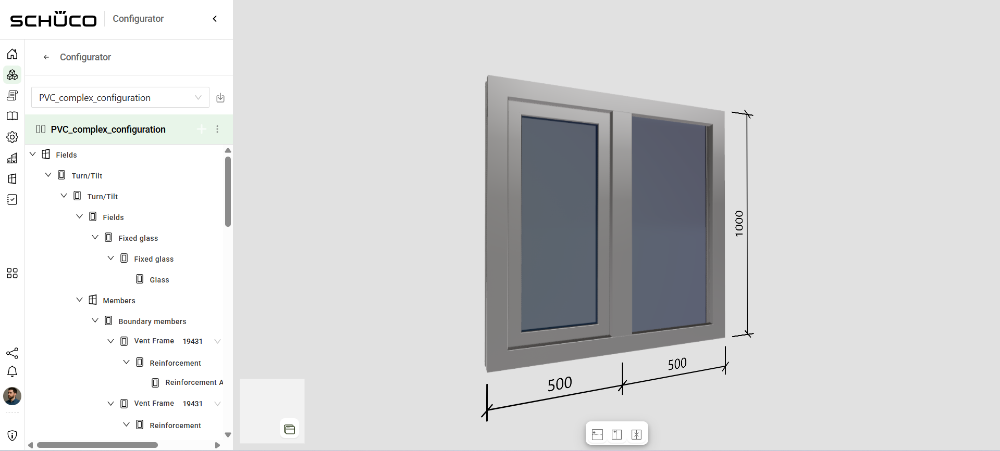
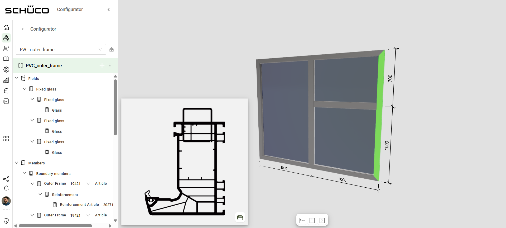
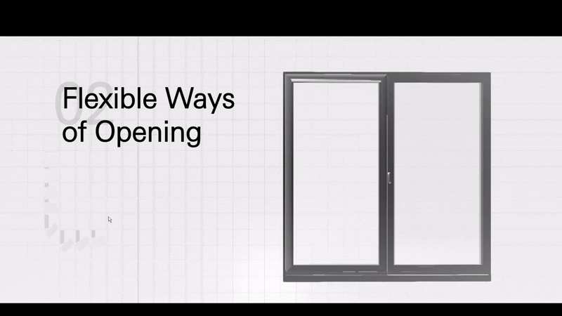

   

     
Commercial Developer Work

     

       <!-- <button aria-label="Minimize"></button>
       <button aria-label="Maximize"></button>
       <button aria-label="Close"></button> -->
     

   

   

     <menu role="tablist">
       <button aria-selected="true" aria-controls="Video">Presentation</button>
       <button aria-selected="false" aria-controls="Summary">Summary</button>
       <button aria-selected="false" aria-controls="Details">Details</button>
     </menu>
     <article role="tabpanel" id="Video">
     <iframe src="https://docs.google.com/presentation/d/e/2PACX-1vSVj7w1TDhlMpsprQcr9DXZIw5q2IpnRfFr4mysclT9FNjajDOMKZHdnxFc4s9E4g/pubembed?start=false&loop=false&delayms=3000" frameborder="0" width="100%" height="700" allowfullscreen="true" mozallowfullscreen="true" webkitallowfullscreen="true"></iframe>
     </article>
     <article role="tabpanel" hidden id="Summary" style="color: black; font-size: 14px; font-variant: JIS04; font-family: arial;">
     
For over six years now I have been working as a creative developer at Virtual Construction Lab in NYC. Here is a list of what I've done over the years:

     
- (current) Writing a typescript library executing an AST for window / door / façade visualization by breaking down assembly (extrusions, translations, mitering, notching) into modular 3D vector operations 

 
-	Lead three.js development on Building Physics Solver, a cloud-based calculation tool that simulates structural, thermal, and acoustic usability of windows / façades for architects and fabricators in Germany, France, and the United States

 
-	Developed system for on-the-fly three.js 3D model generation of sliding doors for fabricators on e-commerce website by utilizing extruded geometry, 3D boolean operations, and custom data structures of part information

 
-	Developed multiple training simulation games using Unreal Engine 4 for new fabrication employees to teach them about types of window vent openings and the process for window assembly 

 
-	Wrote C++ Software in Unreal Engine 4 to enable clients to make their own 3D animations of window part construction for a unified documentation library and for sales proposals

    </article>
     <article role="tabpanel" hidden id="Details"  style="color: black; font-size: 14px; font-variant: JIS04; font-family: arial;">
 

 
 ### Year
 2019 - Present
 
 ### Development Time
 full-time
 
 ### Medium
 Unreal Engine C++, Unreal Engine Virtual Production, Unity, three.js, typescript

 ### Responsibilities
 lead three.js developer, creative developer
 

     </article>
     <article role="tabpanel" hidden id="Awards"  style="color: black; font-size: 14px; font-variant: JIS04; font-family: arial;">
 
 ### Awards, Recognition, Showcases 
 <ul> 

 </ul>
     </article>
     <article role="tabpanel" hidden id="DevLog"  style="color: black; font-size: 14px; font-variant: JIS04; font-family: arial;">
 
 ### Development Log
 <a target="_blank" href="https://drive.google.com/drive/folders/1dT2Lx3qaH6Y8LNbypsF2SCJsWUSLaeTr?usp=sharing">Playtest Screenshots, Assignment Reflection</a>  
     </article>
   

 

 
 
 
 

     <h1 class="title-bar" style="height:30px;">Gallery</h1>
 

 
   
   
   
   
   
   
   
   
   
   
   
   
   
   
   
   
 
 

 

