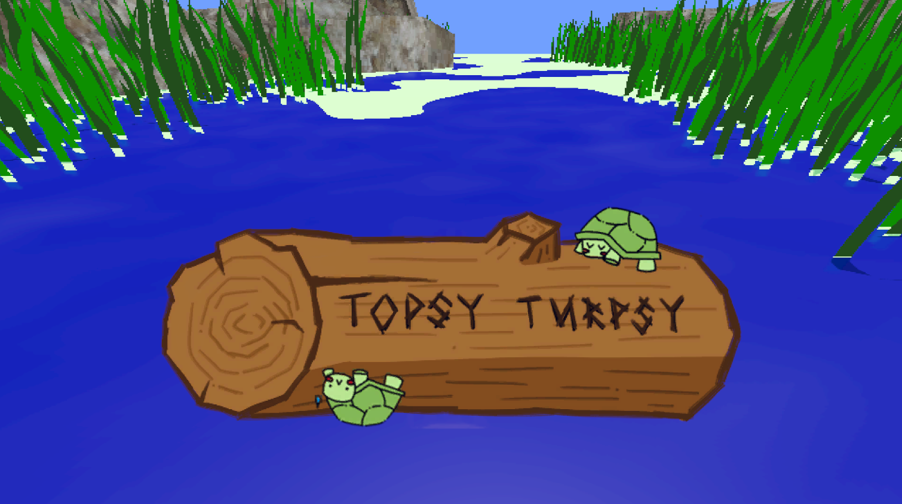
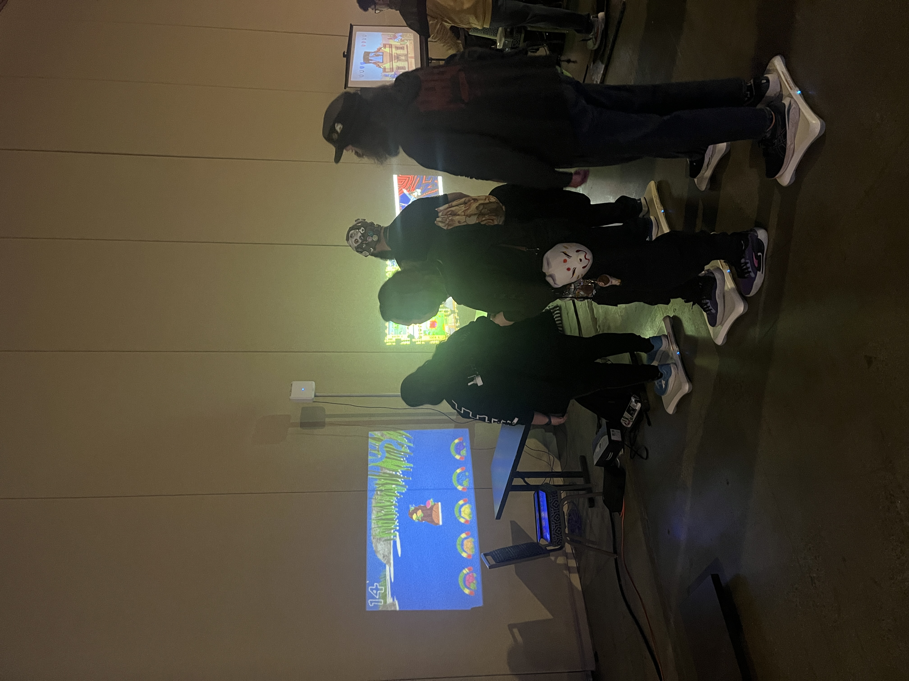

  

    
Topsy Turpsy

    

      <!-- <button aria-label="Minimize"></button>
      <button aria-label="Maximize"></button>
      <button aria-label="Close"></button> -->
    

  

  

    <menu role="tablist">
      <button aria-selected="true" aria-controls="Summary">Summary</button>
      <button aria-selected="false" aria-controls="Details">Details</button>
    </menu>
    <article role="tabpanel" id="Summary" style="color: black; font-size: 14px; font-variant: JIS04; font-family: arial;">
    
Topsy Turpsy is a 5 player wii fit board game made for MAGfest 2025 where each player is a turtle on a log. The net position of each player on the log determines its rotation.

    </article>
    <article role="tabpanel" hidden id="Details"  style="color: black; font-size: 14px; font-variant: JIS04; font-family: arial;">

### Year
2025

### Responsibilities
Programming, Modeling, Development

    </article>

  

    <h1 class="title-bar" style="height:30px;">
      
Gallery

    </h1>


  
  
  
  


