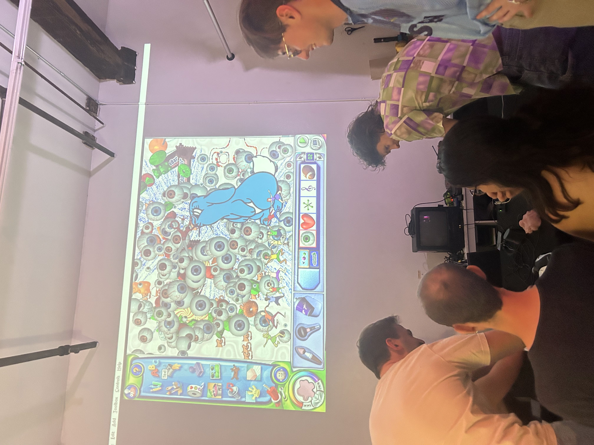
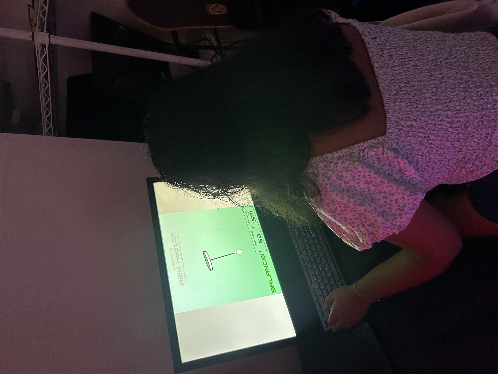

  

    
Alt Ctrl @ boshi's with Wenxiao Ding

    

      <!-- <button aria-label="Minimize"></button>
      <button aria-label="Maximize"></button>
      <button aria-label="Close"></button> -->
    

  

  

    <menu role="tablist">
      <button aria-selected="true" aria-controls="Summary">Summary</button>
      <button aria-selected="false" aria-controls="Details">Details</button>
    </menu>
    <article role="tabpanel" id="Summary" style="color: black; font-size: 14px; font-variant: JIS04; font-family: arial;">
    
In August 2025 I facilitated and curated a games gallery show in Brooklyn, NY that featured works that utilize the computer mosue in interesting ways. Rather than thinking of the mouse as pointing and clicking, the games featured at the show were more about "mouse as controller".

    
Game List:

    <ul>
    <li>Trombone Champ by Studio Wow</li>
    <li>Pogo 3D by Hedgewizards</li>
    <li>The Suzzy Show by Bugfoe</li>
    <li>Scallop Gallop by Jonny Hopkins</li>
    <li>Tilt by Alex Heaton</li>
    <li>Oops! No Brakes by theJaspel</li>
    <li>Ballistic Zen by Alex Hetherington</li>
    <li>and more!</li>
    </ul>
    </article>
    <article role="tabpanel" hidden id="Details"  style="color: black; font-size: 14px; font-variant: JIS04; font-family: arial;">

### Year
2025

### Responsibilities
Facilitation, Planning, Curation, Developer

    </article>

  

    <h1 class="title-bar" style="height:30px;">
      
Gallery

    </h1>


  
  
  
  
  
  
  
  
  
  


