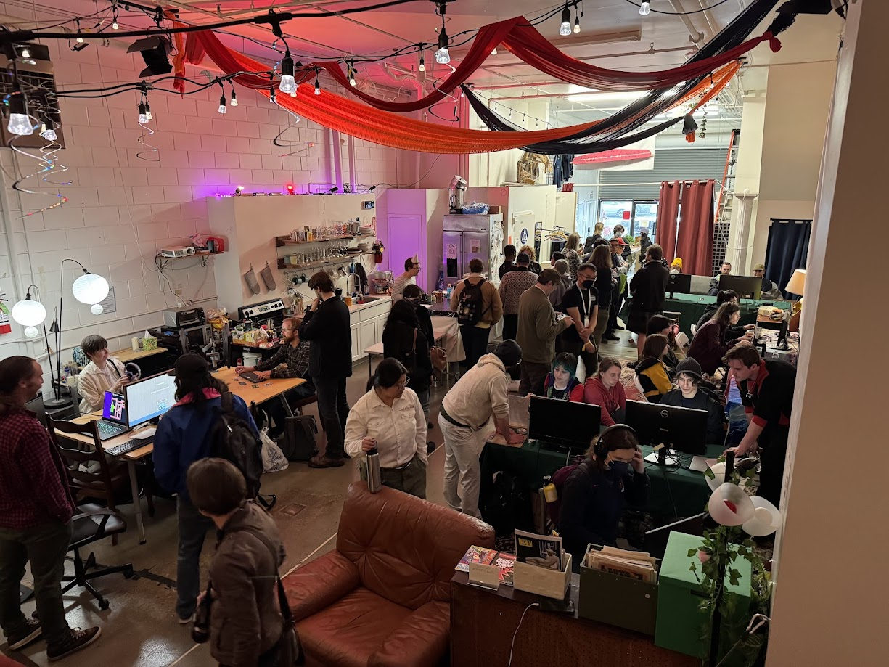
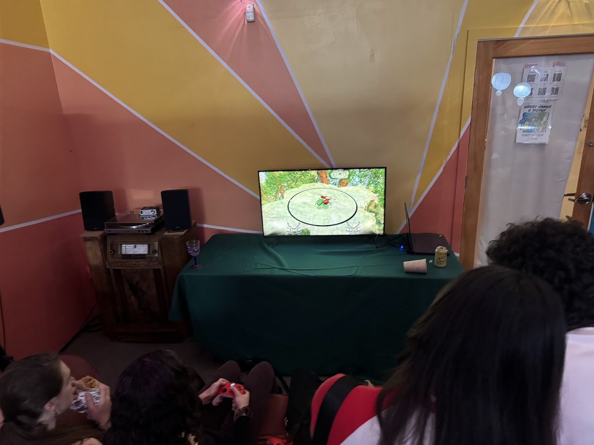

  

    
boshis x syzygy

    

      <!-- <button aria-label="Minimize"></button>
      <button aria-label="Maximize"></button>
      <button aria-label="Close"></button> -->
    

  

  

    <menu role="tablist">
      <button aria-selected="true" aria-controls="Summary">Summary</button>
      <button aria-selected="false" aria-controls="Details">Details</button>
    </menu>
    <article role="tabpanel" id="Summary" style="color: black; font-size: 14px; font-variant: JIS04; font-family: arial;">
    
In March 2025 I helped run a games gallery/party event at GDC in San Francisco. The event was in collaboration with Syzygy, and had about 160 attendees.

    
Game List:

    <ul>
    <li>Museum of the Saved Image by Flan</li>
    <li>Laura Takes a Stroll by Mariopartygod</li>
    <li>Discone by Pondlife</li>
    <li>Jungly Jym by Jonny Hopkins and Luca Civita</li>
    <li>Water Level/b.l.u.e EXPLORATION by Hatim Benhsain</li>
    <li>Magenta Gunslinger by Nichole Shinn</li>
    <li>Puzzle Spy International by BAD collective</li>
    <li>and more!</li>
    </ul>
    </article>
    <article role="tabpanel" hidden id="Details"  style="color: black; font-size: 14px; font-variant: JIS04; font-family: arial;">

### Year
2025

### Responsibilities
Facilitation, Planning

    </article>

  

    <h1 class="title-bar" style="height:30px;">
      
Gallery

    </h1>


  
  
  
  
  



